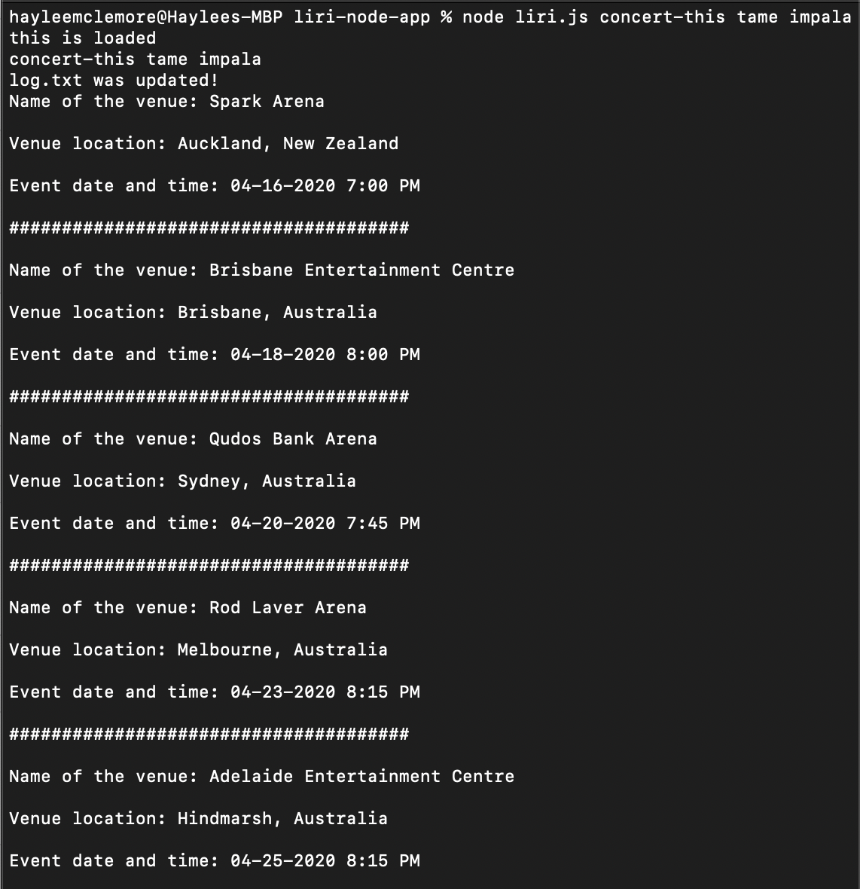
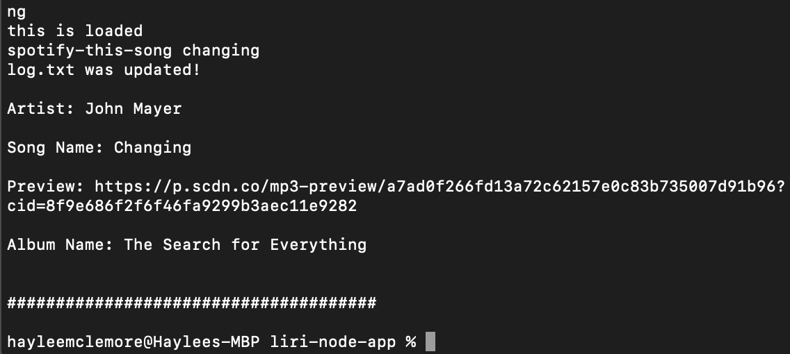
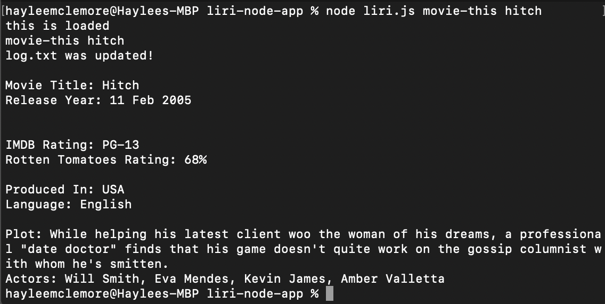
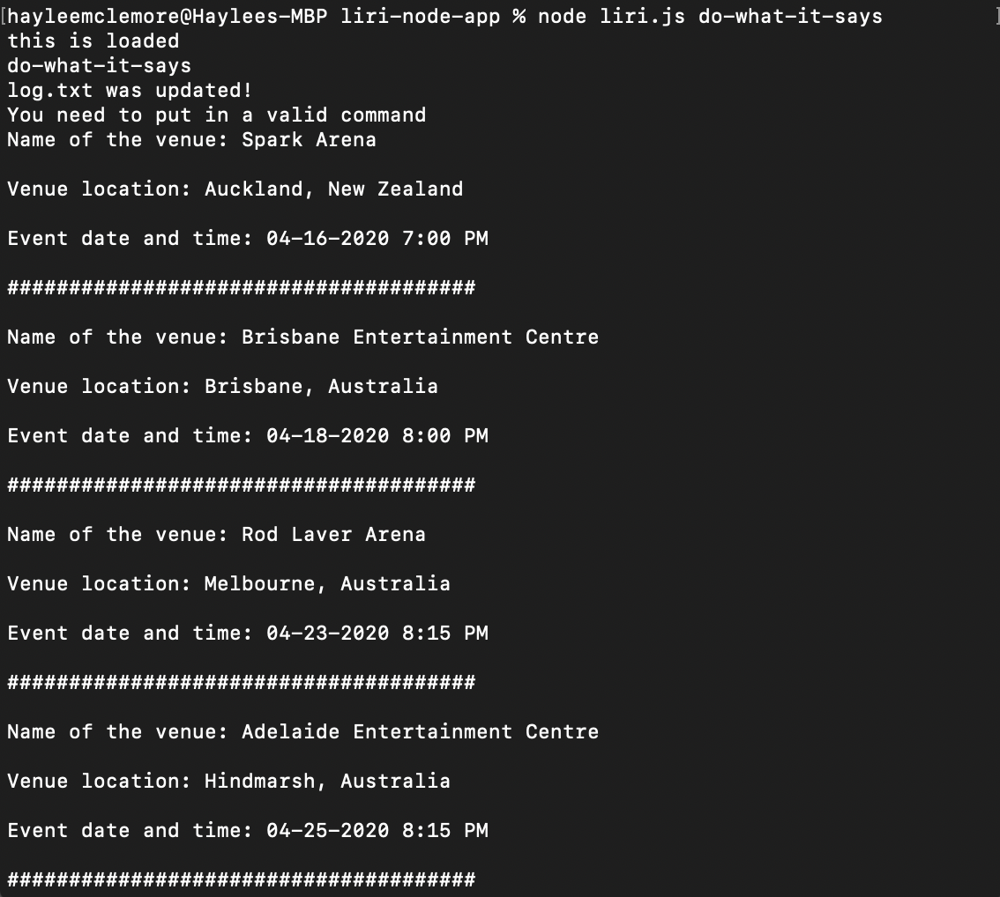

# liri-node-app

This is a repository for the LIRI app, a Language Interpretation and Recognition Interface. LIRI is a command line node app that takes in parameters and returns data.

## Clearly state the problem the app is trying to solve (i.e. what is it doing and why)
The intention of this app was to utilize 
The purpose was to use "backend" technologies only. Node.js was used along with NPM (Node Package Manager) libraries in order to accomplish the tasks. There is no front end to this application, therefore this is no html page to publish.

## Give a high-level overview of how the app is organized

## Instructions:
    LIRI will search Spotify for songs, Bands in Town for concerts, and OMDB for movies.
    It can take in any of the following commands:

   * **`concert-this`**

   * **`spotify-this-song`**

   * **`movie-this`**

   * **`do-what-it-says`**

   Running each of these commands in your terminal/bash window will do the following:

   ### node liri.js concert-this 'concert or band name'
            * Name of the Venue
            * Location of the Venue
            * Date of the Event
    

   ### node liri.js spotify-this-song 'song name'
        * Artist(s)
        * Song Name
        * Album
        * Song Preview Link

        If a song name isn't given, the liri bot will default to searching for 'The Sign.'  

    
    
    ### node liri.js movie-this 'movie name'
        * Movie Title
        * Release Year
        * IMDB Rating
        * Country Produced in
        * Language of the film
        * Plot
        * Actors in Movie
        * Rotten Tomatoes Rating
    
 
        If a movie name isn't given, the liri bot will default to searching for 'Jaws'

   ### node liri.js do-what-it-says

   LIRI will use the text inside of random.txt and use it to call the first command as the command, and the second command as the input.

   The random.txt file includes: concert-this,tame impala
    

## Links
[repository](https://github.com/hayleemclemore/liri-node-app)

## Technologies used in the app:
    * Javascript
    * Node.js
    * Bandsintown API
    * Spotify API
    * OMDB API
